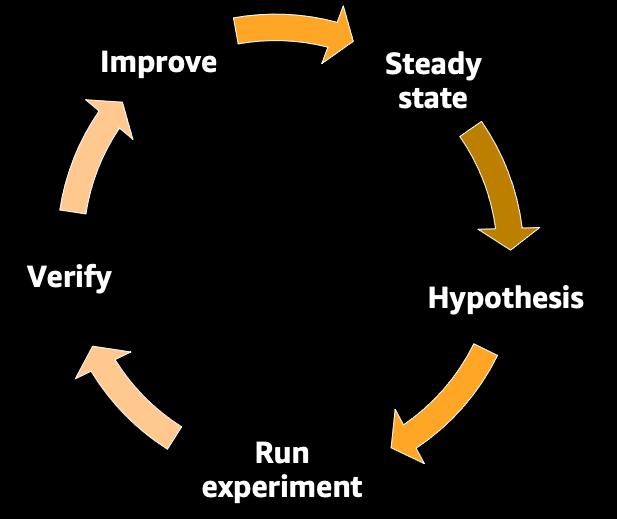
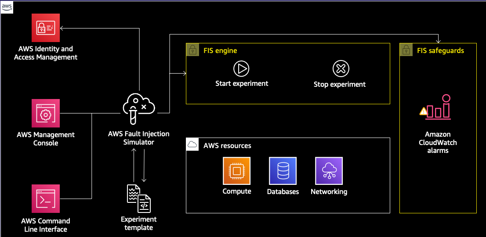

# AWS Fault Injection Simulator 

- [AWS Fault Injection Simulator](#aws-fault-injection-simulator)
  - [Quick Overview of ChaosEngineering](#quick-overview-of-chaosengineering)
  - [Introduction to AWS Fault Injection Simulator](#introduction-to-aws-fault-injection-simulator)
  - [Pre-requisites](#pre-requisites)
    - [Install AWS CLI](#install-aws-cli)
    - [Launch the CloudFormation template.](#launch-the-cloudformation-template)
  - [Experiments](#experiments)
    - [Demo 1 : Stop random EC2 instances using Tags](#demo-1--stop-random-ec2-instances-using-tags)
    - [Demo 2 : Stop random EC2 instances using Tags and Alarms](#demo-2--stop-random-ec2-instances-using-tags-and-alarms)
    - [Demo 3 : Stop random EC2 instances using Tags, Alarms and Filters](#demo-3--stop-random-ec2-instances-using-tags-alarms-and-filters)
    - [Demo 4 : Stop random EC2 instances using SSM](#demo-4--stop-random-ec2-instances-using-ssm)
  - [Clean up](#clean-up)
  - [References and more](#references-and-more)

## Quick Overview of ChaosEngineering 

Chaos engineering is the process of: 
1) Stressing an application in testing or production environments by creating disruptive events, such as server outages or API throttling
2) Observing how the system responds, and 
3) Implementing improvements. 

And we do that to prove, or disprove our assumptions about our system’s capability to handle these disruptive events. But rather than let those disruptive events happen at 3am, during the weekend, and in prod, we create them in a controlled environment, and during working hours.

It is important to note that chaos engineering it is not just about improving the resilience of your application. But also
Its performance
- Uncover hidden issues
- Expose monitoring, observability & alarm blind spots
- and more - like Improve recovery time, Improve operational skills The culture .. etc 

There are different phases of Chaos Engineering.



## Introduction to AWS Fault Injection Simulator
AWS Fault Injection Simulator (AWS FIS) is a managed service that enables you to perform fault injection experiments on your AWS workloads. Fault injection is based on the principles of chaos engineering. These experiments stress an application by creating disruptive events so that you can observe how your application responds. You can then use this information to improve the performance and resiliency of your applications so that they behave as expected.

To use AWS FIS, you set up and run experiments that help you create the real-world conditions needed to uncover application issues that can be difficult to find otherwise. AWS FIS provides templates that generate disruptions, and the controls and guardrails that you need to run experiments in production, such as automatically rolling back or stopping the experiment if specific conditions are met.

:exclamation::exclamation: Important Warning :exclamation::exclamation:
:---: 
AWS FIS carries out real actions on real AWS resources in your system. Therefore, before you use AWS FIS to run experiments in production, we strongly recommend that you complete a planning phase and run the experiments in a pre-production environment.



## Pre-requisites

### Install AWS CLI
To complete these demos, ensure you have AWS CLI installed and configured. 

### Launch the CloudFormation template. 

1. Create a Keypair in your AWS account and note the Keypair name
2. In the below command, replace the _\<keypair-name\>_ with your Keypair from Step 1. Run the command to create the CloudFormation stack. 

```
aws cloudformation create-stack --template-body file://cfn_fis_demo.json --stack-name fis-demo-stack --capabilities CAPABILITY_NAMED_IAM --parameters ParameterKey=KeyPairName,ParameterValue=<keypair-name>

```
It creates 11 EC2 instances of t2.micro. Edit the CloudFormation template, if you wish to launch fewer EC2 instances. Ensure you have instances in both the subnets/Availability zones. 

## Experiments

We will be running simple experiments like stopping an EC2 instance or stress CPU on an EC2 instance. 

To identify your target resources like which EC2 instances FIS can carry out the actions, you can specify the following:

- **Resource tags** – The tags applied to target resources. For example, you can specify that the target EC2 instances must include the tag "Experiment=ChaosReady". You will learn how to specify resources based on tags in Demo 1.

- **Resource filters** – The path and values that represent resources with specific attributes. For more information, see Resource filters. You will learn how to specify resources based on tags and filters in Demo 3.

- **Resource IDs** – The resource IDs of specific AWS resources. For example, the resource ID of an Amazon EC2 instance, such as i-12345abcd. All resource IDs must be the same resource type. You will learn how to specify specific AWS resources in Demo 4.


### [Demo 1 : Stop random EC2 instances using Tags](demo-1/)
### [Demo 2 : Stop random EC2 instances using Tags and Alarms](demo-2/)
### [Demo 3 : Stop random EC2 instances using Tags, Alarms and Filters](demo-3/)
### [Demo 4 : Stop random EC2 instances using SSM](demo-4/)

## Clean up

Remember to delete all the resources once you are done testing.

1. Delete the FIS Experiments. Replace _\<value\>_ with your experiment IDs. Use `aws fis list-experiment-templates` to retrieve the list.

```
aws fis delete-experiment-template --id <value>
```
2. Delete the CloudFormation stack
   
```
aws cloudformation delete-stack --stack-name fis-demo-stack
```


## References and more

[AWS Fault Injection Simulator](https://aws.amazon.com/fis/)

[AWS FIS Documentation](https://docs.aws.amazon.com/fis)

[AWS Blog AWS Fault Injection Simulator – Use Controlled Experiments to Boost Resilience](https://aws.amazon.com/blogs/aws/aws-fault-injection-simulator-use-controlled-experiments-to-boost-resilience/)
