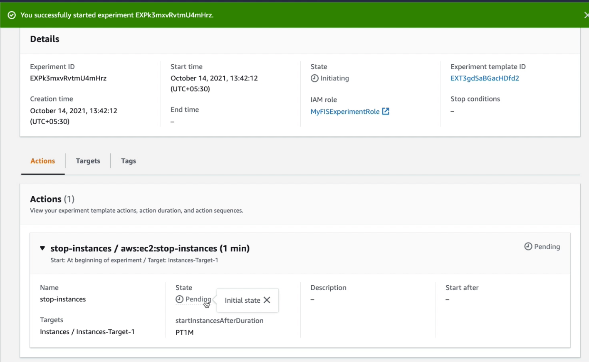
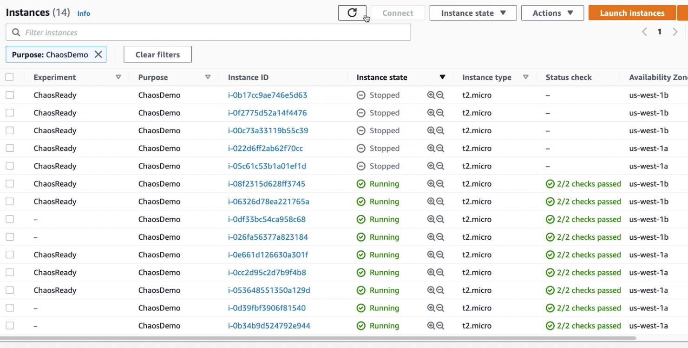

# Demo 1 : Stop random EC2 instances using Tags 

In this experiment, we will be randomly stopping instances that are tagged. We will also learn how these resources can be automatically be started. This experiment is to showcase simple randomly stopping instances and then getting them back to stead state once deployment is successfully deployed.

## Deployment

1. Update the IAM Role Account ID in the [/demo-1/fis-stop-random.json](fis-stop-random.json). Replace _\<01234567890\>_, with your Account ID.

```
"roleArn": "arn:aws:iam::<01234567890>:role/MyFISExperimentRole"
```

2. Create AWS FIS Experiment Template to randomly stop and re-start 3 random tagged instances. These instances will be automatically started in 2 mins. 

```
aws fis create-experiment-template --cli-input-json file://fis-stop-random.json
```

3. Start the AWS FIS Experiment

Copy the Experiment ID from output of command in step 2. Paste the Experiment ID in _\<experiment-template-id\>_

```
aws fis start-experiment --experiment-template-id <experiment-template-id>
```


## Observe

If you are using FIS for the first time then it is easy to view the experiments in the AWS Console. 

When you start the AWS FIS Experiment, FIS will randomly stop 3 instances that are tagged with the keypair "Experiment=ChaosReady". It will wait for 2mins and restart the EC2 instances. 


