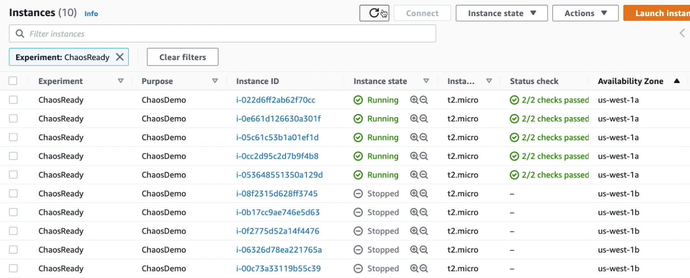

# Demo 3 : Stop random EC2 instances using Tags, Alarms and Filters 

In this experiment, we will be stopping instances that are tagged and are in a particular Availability Zone. We will also setup CloudWatch alarm to showcase FIS safeguard and rollback to stead state. When the CloudWatch alarm goes into Alarm state, the experiment is stopped and all instances are started automatically. This experiment is to showcase simple stopping instances based on **tags and filters** and then getting them back to stead state if an Alarm is raised. 

## Deployment

1. Update the IAM Role Account ID and CloudWatch Alarm in the [/demo-3/fis-stop-filters.json](fis-stop-filters.json). Replace _\<01234567890\>_, with your Account ID. Also, replace the _\<region\>_ with correct region. Make sure the Availability Zone b is properly written in values. For example, for _us-east-1_, the AZ would be _us-east-1b_.

```
"value": "arn:aws:cloudwatch:<region>:<01234567890>:alarm:NetworkInAbnormal"

"values": ["<region>b"]

"roleArn": "arn:aws:iam::<01234567890>:role/MyFISExperimentRole"

```

1. Create AWS FIS Experiment Template to stop and re-start instances that are tagged with the keypair "Experiment=ChaosReady" and are in Availability Zone b. These instances will be automatically started in 5 mins. 

```
aws fis create-experiment-template --cli-input-json file://fis-stop-filters.json
```

3. Start the AWS FIS Experiment

Copy the Experiment ID from output of command in step 2. Paste the Experiment ID in _\<experiment-template-id\>_

```
aws fis start-experiment --experiment-template-id <experiment-template-id>
```

4. Confirm that the EC2 instances in the AZ b have stopped.
 
5. If you want to start the instances earlier than 5mins mark, run the following command to manually trigger the CloudWatch Alarm. 

```
aws cloudwatch set-alarm-state --alarm-name "NetworkInAbnormal" --state-value ALARM --state-reason "testing-rollback" 
``` 


## Observe

If you are using FIS for the first time then it is easy to view the experiments in the AWS Console. 

When you start the AWS FIS Experiment, FIS will stop all instances that are tagged with the keypair "Experiment=ChaosReady" and are in Availability Zone b. It will wait for 5 mins before restarting the EC2 instances. 

However, we will simulate real world use-case of issue detected when instances went offline and a CloudWatch alarm is raised. As the Alarm state changes to InAlarm, FIS will stop the experiment and rollback to stead state, i.e. all instances are up and running.

