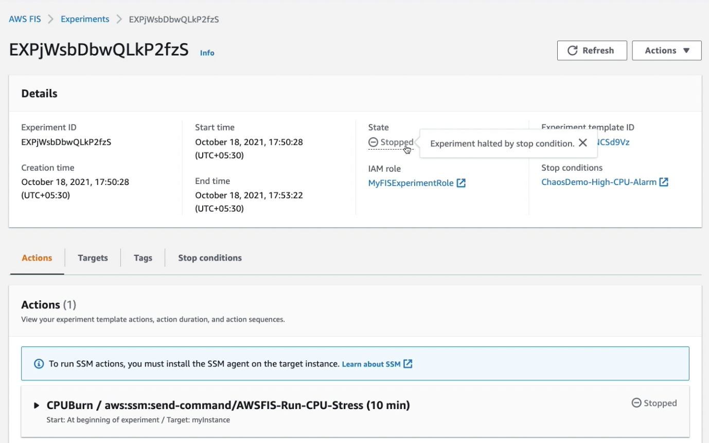

# Demo 4 : Stop random EC2 instances using SSM


In this experiment, we will be stopping instances that are tagged and are in a particular Availability Zone. We will also setup CloudWatch alarm to showcase FIS safeguard and rollback to stead state. When the CloudWatch alarm goes into Alarm state, the experiment is stopped and all instances are started automatically. This experiment is to showcase simple stopping instances based on **tags and filters** and then getting them back to stead state if an Alarm is raised. 

## Deployment

1. Update the IAM Role Account ID and CloudWatch Alarm in the [/demo-4/ssm-fis.json](ssm-fis.json). Replace _\<01234567890\>_, with your Account ID. Also, replace the _\<region\>_ with correct region. Also, copy the instance ID from Outputs tab of CloudFormation stack deployed in pre-requisites and replace _\<instance-id\>_ with it.

```
"documentArn": "arn:aws:ssm:<region>::document/AWSFIS-Run-CPU-Stress",

"resourceArns": ["arn:aws:ec2:<region>:<01234567890>:instance/<instance-id>"],

"value": "arn:aws:cloudwatch:<region>:<01234567890>:alarm:ChaosDemo-High-CPU-Alarm"

"roleArn": "arn:aws:iam::<01234567890>:role/MyFISExperimentRole"

```

2. Create AWS FIS Experiment Template to randomly stop and re-start 3 random tagged instances. These instances will be automatically started in 5 mins. 

```
aws fis create-experiment-template --cli-input-json file://ssm-fis.json
```

1. Before you start the experiment, SSH into the EC2 instance and run `top` or `htop`. You can see the live CPU Utilisation of the EC2 instance. Monitor this while the FIS experiment is running. Copy the public DNS name of EC2 instance from Outputs tab of CloudFormation stack deployed in pre-requisites and replace _\<Public-DNS\>_ with it. 

```
chmod 400 FISdemoKeyPair.pem
ssh -i FISdemoKeyPair.pem ec2-user@<Public-DNS>
```


4. Start the AWS FIS Experiment

Copy the Experiment ID from output of command in step 2. Paste the Experiment ID in _\<experiment-template-id\>_

```
aws fis start-experiment --experiment-template-id <experiment-template-id>
```
 
5. Watch the CloudWatch Alarm. Within couple of minutes the CPU Utilisation will be higher than the threashold - .It will automatically go into InAlarm state and trigger FIS to stop the experiment. 

## Observe

If you are using FIS for the first time then it is easy to view the experiments in the AWS Console. 

When you start the AWS FIS Experiment, FIS will run stress.ng on the instance via AWS Systems Manager. This will increase CPU Utilisation and ultimately raise the CloudWatch Alarm. The Alarm will then shut down the experiment.

